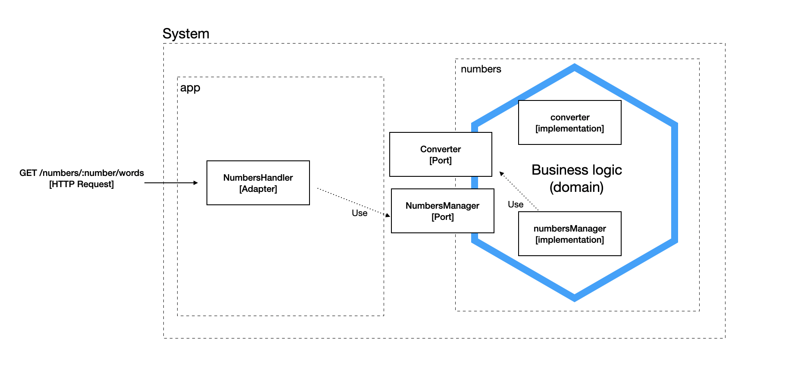
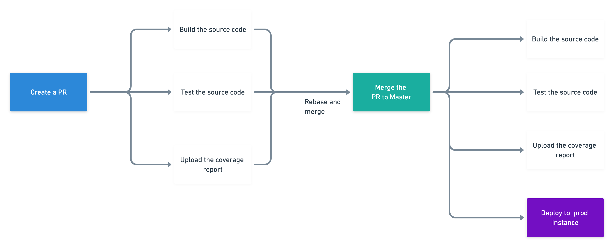

# Fama

[](https://codecov.io/gh/cristianchaparroa/fama)

Fama is a project that is in charge to transform numbers into words.

This repository follows the hexagonal architecture and the follow diagram is an
overview of it
 

## Local development environment

### Requirements

You should have installed Go in your machine, please follow this guide https://golang.org/doc/install 

### Download the project 

```shell script
git clone https://github.com/cristianchaparroa/fama.git 
```
### Execute the application

You can run the server using the following command

```shell script
cd path/to/project/fama/
go run *.go
``` 

After executes the last commands you can start to using the API. 

### Docker

If is not possible create a local environment, and you have docker installed in 
your machine you can follow the next steps to run the application.

```shell script
cd path/to/project/fama/
docker build -t fama .
docker run -p 8080:8080 fama
```


### Docker-compose

If you have installed `docker` and `docker-compose` you also can deploy the services just with

```shell script
cd path/to/project/fama/
docker-compose up
```
It'll start the API server that will be exhibited in
```
{host}:8080
```
And the swagger documentation will be expose in 
```
{host}:8081
``` 

## Infrastructure deployment

The following are the steps to set up the Digitalocean account and terraform.

1. First of all you need to create a token as is showed on https://www.digitalocean.com/docs/apis-clis/api/create-personal-access-token/
after that should export the token as environment variable to work with it properly.

2. You should setup the ssh key into the digitalocean, if you don't have it you should follow the next documentation https://www.digitalocean.com/docs/droplets/how-to/add-ssh-keys/

3. The `fama_rsa` ssh key was add in the second step to digital ocean account. 
Now it needed to retrieve the ssh key finger print.

```shell script
ssh-keygen -E md5 -lf ~/.ssh/fama_rsa.pub | awk '{print $2}'
md5:d0:65:34:b8:42:93:88:45:24:59:cd:a7:e7:90:c2:6d
```
You need to take the part after `md5:` in this case should be `d0:65:34:b8:42:93:88:45:24:59:cd:a7:e7:90:c2:6d`

After the last steps is need to add all credentials in the `terraform.tfvars`

Before to run the terraform plan is need to download the terraform dependencies then you need to run the command init.
After it you need to validate it check all structures you have all correct.
```shell script
cd terraform/production
terraform init
terraform validate
```

Next we should need to generate the plan
```shell script
terraform plan  -var-file=terraform.json
```

Finally we can deploy the plan with the command
```shell script
terraform apply -var-file=terraform.json
```


## Deployment 

### Setup
The repository uses Github Actions, there is a `deploy-prod.yml` flow in 
which is configured the pipeline to deploy into the remote instance each time  
there is a push into the master branch. To work properly must be configured the secrets stored in Github.

| Secret   |      Description      | 
|----------|:-------------:|
| CODECOV_TOKEN|  It's the token from codecov to upload the report of coverage | 
| PRO_SERVER_HOST |    It's the server host in which the repository will be deployed   |  
| PRO_SERVER_PORT|  This is the port used for ssh |  
| PRO_SERVER_PRIVATE_KEY|  This is the private key to logged into the instance |  
| PRO_SERVER_USERNAME|   It's the name in the server to logged  |  

The following image illustrates the full process of deployment
 

## Testing

### Unit testing

You can run the unit testing using
```shell script
go test ./... 
``` 

### Testing the functionality 

The full API documentation you should find in `api/swagger-spec/openapi.yaml` or
also you can find in 
```shell script
http://67.205.161.100:8081/
``` 
You can test the endpoint using:

```shell script
curl --request GET \
  --url 'http://67.205.161.100:8080/numbers/145450/words?lang=fr'
```
